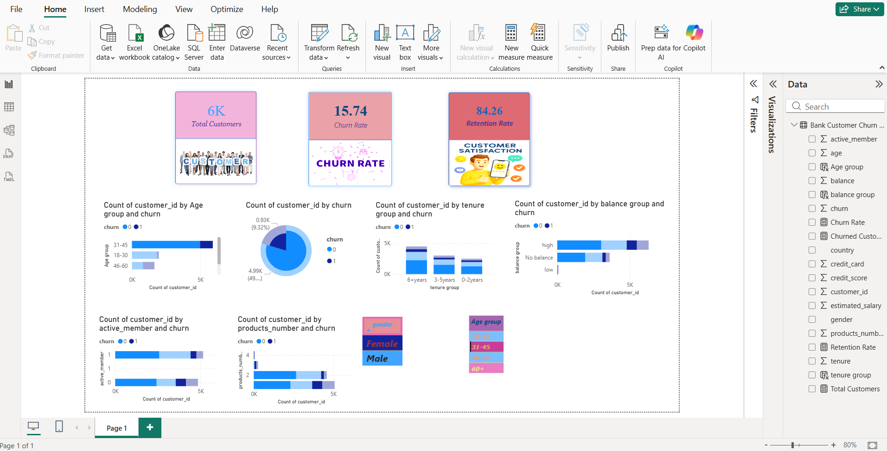

# FUTURE_DS_02
# 📊 Customer Retention & Churn Analysis (Bank Dataset)

## 📌 Project Overview

This project focuses on analyzing customer data to identify **churn patterns**, **retention trends**, and key factors influencing customer behavior in a banking system.

The goal is to understand why customers leave and provide actionable insights to improve customer retention.

## 🎯 Objectives

* Analyze customer churn behavior
* Identify key factors affecting retention
* Perform cohort and retention analysis
* Build an interactive dashboard for insights

## 📁 Dataset Used

* Bank Customer Churn Dataset (CSV)
* Contains customer details such as:

  * Age
  * Gender
  * Tenure
  * Balance
  * Number of Products
  * Active Member Status
  * Churn (Exited)

## 🛠 Tools & Technologies

* Power BI
* Data Cleaning using Power Query
* DAX (Data Analysis Expressions)

## 🧹 Data Cleaning Steps

* Removed unnecessary columns (RowNumber, Surname)
* Renamed columns for better understanding
* Converted data types
* Transformed churn values (0 → No, 1 → Yes)
* Created new columns:

  * Age Group
  * Tenure Group
  * Balance Group

## 📊 Key Metrics

* Total Customers
* Churn Rate
* Retention Rate

## 📈 Dashboard Features

* KPI Cards (Total Customers, Churn Rate, Retention Rate)
* Churn Distribution (Pie Chart)
* Churn by Age Group
* Churn by Tenure
* Churn by Active Member Status
* Churn by Number of Products
* Churn by Balance Group
* Interactive Filters (Slicers)

## 🔍 Key Insights

* Customers with **low tenure** have higher churn rates
* **Inactive customers** are more likely to leave
* Customers with **fewer products** tend to churn more
* Balance levels influence customer retention
* Certain age groups show different churn behavior

## 💡 Recommendations

* Improve engagement strategies for inactive customers
* Provide special offers for new customers
* Encourage customers to use multiple products
* Develop targeted retention campaigns

## 📸 Dashboard Preview

## 🚀 Conclusion

This analysis helps in understanding customer behavior and provides actionable insights to reduce churn and improve retention strategies.

## 👩‍💻 Author

Your Gagana Sindhu
